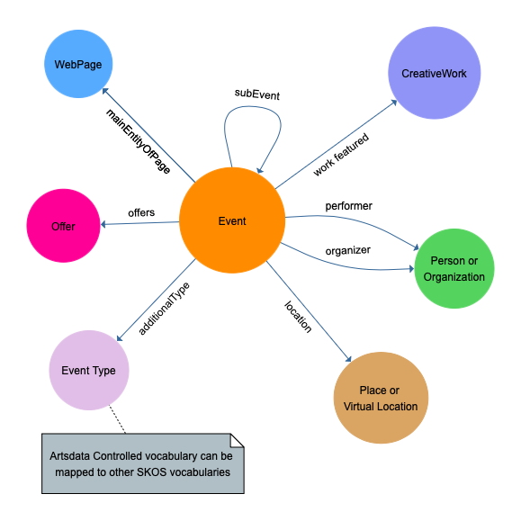





## Modèle de données Artsdata v{{ site.data.versions.schemaVersion }}
[Edit page](https://github.com/culturecreates/artsdata-data-model/blob/master/{{page.path}}) | 

Un modèle de données simple pour les événements dans les arts de la scène ainsi que pour les lieux, les personnes et les organismes connexes. 

Le modèle de données (ontologie) d’Artsdata est un sous-ensemble de Schema.org avec quelques vocabulaires contrôlés additionnels. Le modèle d'Artsdata.ca est représenté formellement avec le language SHACL [ici](https://kg.artsdata.ca/query/show?sparql=https://raw.githubusercontent.com/artsdata-stewards/artsdata-actions/main/queries/artsdata_SHACL_validation_rules.sparql).

Les classes et propriétés utilisées dans Artsdata sont similaires au modèle de [Google Event Structured Data](https://developers.google.com/search/docs/appearance/structured-data/event?hl=fr). En particulier, les propriétés obligatoires pour les événements dans la documentation de Google sont aussi des propriétés obligatoires dans Artsdata.  La différence principale est qu’Artsdata enrichit les données structurées avec des URIs et relie les URIs vers Wikidata et d’autres sources LOD (Linked Open Data). Artsdata génère également des URI (identifiants globaux uniques et pérennes) pour les événements, personnes, lieux, organisations et aussi pour quelques vocabulaires contrôlés comme des types d'événements spécifiques aux arts de la scène. Ces URIs peuvent être utilisés en dehors d'Artsdata.

Voici les Classes utilisées dans Artsdata.

[[open drawing tool](https://www.yworks.com/yed-live/?file=https://gist.githubusercontent.com/saumier/499adb05caf71d67a85f70796e2ca9b7/raw/9f6b51cc36c6df3c9265e42fd5f241741f67a93e/artsdata_event_model)]

### Classes

<ol>

<li>
    <a href="{{ base }}{{ class.url }}">
        {{ class.class_name }}
    </a>
</li>

</ol>

### Identifiants passerelles
En plus de l'identifiant Artsdata, le graphe de connaissance Artsdata s'appuie sur d'autres identifiants uniques pérennes, comme l'identifiant Wikidata et l'ISNI, afin de reconnaître et de réconcilier les entités nommées des classes [Organization](https://culturecreates.github.io/artsdata-data-model/classes/organization.html), [Person](https://culturecreates.github.io/artsdata-data-model/classes/person.html) et [Place](https://culturecreates.github.io/artsdata-data-model/classes/place.html). 

[Recommandations à propos des identifiants pérennes dans les arts de la scène](https://docs.google.com/spreadsheets/d/1j2Be-KBZm4LioW3DH2NU7GR3m77boTeQcIHZe8OMK3U/edit#gid=1000818759)

### Gabarits de données structurées
[Gabarits pour les événements]({{ base }}/gabarits-jsonld/README.fr.html)
[Gabarits pour les personnes](https://docs.google.com/document/d/e/2PACX-1vRorpIgx1arsAqGuiR428j74uxk5K2V63f9yHgWn1C4CyqxH3mMk_Hw92JsGJBh4CKprGc9rG85Gfcn/pub)

### Rapports de validation SHACL

Les formes [SHACL]({{ base }}/shacl_reports.html) sont utilisées pour valider les données avant l’importation.

### Ontologies et inférences

Artsdata.ca utilise un ensemble de bases d’implications RDFS et OWL afin de permettre une inférence simple, appelé **OWL-Horst (optimized)**. 

La principale ontologie utilisée dans Artsdata.ca est **Schema.org**. Artsdata.ca importe le schéma de base Schema.org et le schéma Schema.org en attente (pour inclure schema:EventSeries qui est une classe en attente).  

Artsdata.ca a un grand nombre de mappages de classes et de propriétés entre Schema.org, Wikidata.org, DBpedia.org, FOAF and DOLCE+DnS Ultralite (Ontology Design Patterns) en utilisant owl:equivalentClass and owl:equivalentProperty. La majorité des mappages sont préconstruits à partir d’ontologies externes avec quelques mappages supplémentaires spécifiques à [Artsdata.ca](http://kg.artsdata.ca/Wikidata_Mapping) à Wikidata. 

Les travaux en cours sur la prochaine version de l’ontologie Artsdata.ca sont influencés par les travaux de l’initiative [Un avenir numérique lié](https://linkeddigitalfuture.ca/fr/accueil/) de CAPACOA et impliquent l’alignement du modèle de données avec les modèles de données utilisés dans le patrimoine culturel, y compris, mais sans s’y limiter, CIDOC-CRM, FRBRoo, PROV et RDA. Les modèles de données seront en outre spécifiés par un vocabulaire spécifique au domaine qui sera publié dans les prochaines versions.

#### Ontologies chargées dans Artsdata
* [https://www.w3.org/2000/01/rdf-schema](https://www.w3.org/2000/01/rdf-schema)
* [Ontologies externes](https://github.com/culturecreates/artsdata-data-model/tree/master/_triples)
* [Vocabulaires contrôlés par Artsdata](https://github.com/culturecreates/artsdata-data-model/tree/master/ontology)
    * [http://kg.artsdata.ca/resource/ArtsdataEventTypes](http://kg.artsdata.ca/resource/ArtsdataEventTypes)
    * [http://kg.artsdata.ca/resource/ArtsdataOrganizationTypes](http://kg.artsdata.ca/resource/ArtsdataOrganizationTypes)

### Provenance

Voir la section plus bas en anglais.

### Architecture de flux de données

En principe, n’importe qui peut ajouter des données à Artsdata.ca pourvu que certaines exigences en matière de données soient respectées. Voici un [diagramme]({{ base }}/architecture/overview.html) sur la façon dont les données entrent et sortent d’Artsdata.ca.

### Données ouvertes et liées, mise en cache

Artsdata.ca charge les données ouvertes et liées de Wikidata et DBpedia afin de les mettre en cache pour des raisons de performances. Les triplets sont obtenus en utilisant la négociation de contenu (au lieu de vidages de données) et sont mis en cache sans modification dans leurs graphes nommés respectifs. 

**Remarque:** il existe une exception notable, la propriété Wikidata **P31** (instance de) est transformée en **rdf:type**.  Ce même résultat aurait pu être obtenu en utilisant owl:equivalentProperty mais il n’a pas été sélectionné pour des raisons de performances.

### Conventions de nommage

[Conventions]({{ base }}/naming_conventions.html) sur la façon de nommer les choses en cas de doute.

### Assistance ou contact

[Contactez nous](mailto:support@culturecreates.com).
